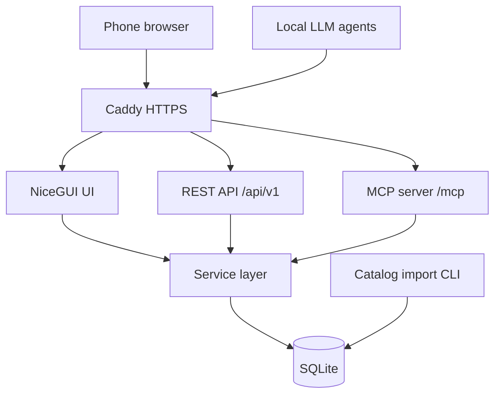
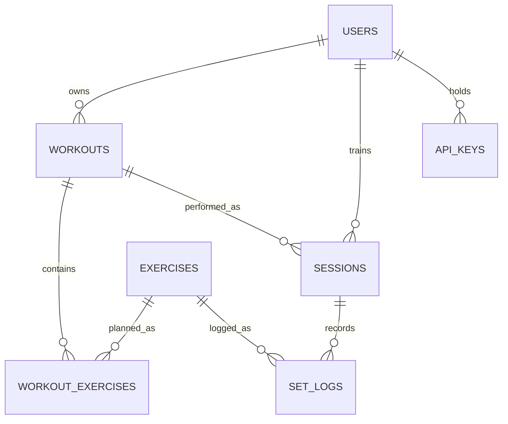

# Exercise Tracker — Phase 1 Spec

2026-09-22 · @Someone

## Overview

Phase 1 delivers a mobile-first workout tracker for a few invited users, plus a REST API and MCP server for the owner's local LLM agents.

- **Users:** Josue (admin) and a small group he invites. No public sign-up.
- **Core loop:** build workouts from a shared exercise catalog, then log weight and reps for every set while seeing the last session's numbers.
- **LLM access:** own agents and local LLM clients, over REST and MCP, authenticated with per-user API keys.
- **Stack:** Python + NiceGUI, self-hosted on the Oracle ARM VPS behind Caddy at gym.api-mcp.com.
- **Language:** all code, comments, docstrings and UI strings in English.

**Out of scope for phase 1:** OAuth and Claude.ai/ChatGPT connectors, offline mode, user-created exercises, workout sharing, progress charts, Spanish UI.

## Key decisions

Ten decisions shape phase 1; each one is listed with the reason behind it so the coding agent doesn't undo it.

| Area | Decision | Why |
| --- | --- | --- |
| Architecture | One process: NiceGUI UI, REST API and MCP server as thin adapters over one service layer | One deploy, least code; the service layer keeps a later split cheap |
| Database | SQLite in WAL mode | A few users; one file to back up |
| Agent auth | Per-user API keys in a Bearer header | Local agents can send headers; OAuth deferred to phase 2 |
| People auth | Email + password, invite-only | No external identity provider until phase 2 |
| Catalog | Import both datasets into the local DB; never call ExerciseDB at runtime | Its free tier is rate-limited and not meant for production |
| Logging model | Plans (workouts) separate from logs (sessions, sets) | History survives plan edits and deletes |
| Plan targets | Sets plus a rep range, e.g. 3 × 8–12 | Matches how programs are written; a fixed target is min = max |
| Weight storage | Value + unit exactly as entered | No lb/kg rounding drift |
| Agent permissions | Read everything, create/edit workouts, log and correct sets; no deletes | Deletes need a human in the UI |
| Data ownership | `user_id` on workouts, sessions, set logs and API keys; child rows inherit it; always taken from the auth context | An agent can never reach another user's data |

## Architecture

One uvicorn process with a single worker (a NiceGUI requirement) hosts three adapters over a transport-agnostic service layer.

The UI, REST API and MCP server never talk to each other; each one only calls the service layer.

**Layering rules**

- The service layer imports nothing from NiceGUI, FastAPI or MCP. It takes a user context plus plain arguments and returns Pydantic models.
- Services are synchronous and open one DB session per call.
- Adapters call services off the event loop: sync FastAPI endpoints (threadpool), `run.io_bound` in NiceGUI, `anyio.to_thread.run_sync` in MCP tools. Why: a blocking DB call on the event loop freezes every connected phone and agent.
- Adapters never touch the database or apply business rules. They only translate their transport into service calls.
- The MCP server is a sibling of the REST API in the same process, not a client of it. Why: no internal network hop, one source of truth.
- `app.py` is the composition root: it creates the FastAPI app, attaches NiceGUI, includes the API router and mounts the MCP app.
- The FastAPI lifespan must enter the MCP app's lifespan, or the MCP session manager never starts.
- The public MCP endpoint must be exactly `/mcp`. FastMCP's own path plus the mount path can silently double it to `/mcp/mcp`.

**Module layout**

| Path | Contents |
| --- | --- |
| `app.py` | Composition root |
| `config.py` | Settings loaded from `.env` |
| `db/` | Engine, models, Alembic migrations |
| `services/` | `users`, `api_keys`, `catalog`, `workouts`, `sessions`, `stats` |
| `api/` | REST routers and request/response schemas |
| `mcp_server/` | MCP tool definitions (named to avoid shadowing the `mcp` package) |
| `ui/` | NiceGUI pages and reusable components |
| `scripts/import_catalog.py` | Catalog import CLI |
| `tests/` | pytest suites |
| `data/` | SQLite file, media, backups, NiceGUI storage (git-ignored) |

## Tech stack

Python 3.12 with dependencies pinned in a lock file; each library is chosen so phase 2 is a small change rather than a migration.

| Concern | Choice | Note |
| --- | --- | --- |
| Web + API | FastAPI on uvicorn, 1 worker | NiceGUI needs a single worker |
| UI | NiceGUI attached to the FastAPI app (`ui.run_with`) | Quasar components, mobile-first |
| ORM + migrations | SQLAlchemy 2.x + Alembic | Migrations from day one |
| Schemas | Pydantic v2 | Shared by services, API and MCP |
| MCP | Standalone `fastmcp` package at its current stable release, Streamable HTTP | Pin the exact version; its OIDC proxy (2.12+) is the phase 2 path |
| Passwords | Argon2id via `argon2-cffi` |  |
| Settings | `pydantic-settings` | Secrets from `.env`, never committed |
| Import HTTP client | `httpx` with retry and backoff |  |
| Tests | `pytest` |  |

## Exercise catalog import

A re-runnable CLI loads both datasets into the `exercises` table; the running app never calls either source.

**free-exercise-db**

- [free-exercise-db](https://github.com/yuhonas/free-exercise-db): 800+ exercises, public domain (Unlicense).
- Read the combined `dist/exercises.json`. Fields: id, name, force, level, mechanic, equipment, primaryMuscles, secondaryMuscles, instructions, category, images.
- `force`, `mechanic` and `equipment` can be null; accept nulls.
- Download each image (usually a start and an end frame) into `data/media/free-exercise-db/` and serve it locally. Why: public domain, and no runtime dependency on GitHub.

**ExerciseDB V1 (free)**

- [ExerciseDB V1 docs](https://oss.exercisedb.dev/docs): about 1,500 exercises with 180p GIFs; non-commercial use only, attribution required.
- Base URL `https://oss.exercisedb.dev/api/v1`, list endpoint `/exercises`. Fields: exerciseId, name, gifUrl, targetMuscles, bodyParts, equipments, secondaryMuscles, instructions.
- The OpenAPI spec is at `https://oss.exercisedb.dev/swagger`; `/docs` is only a viewer. Confirm field names there before coding.
- Pagination, as documented by [another project](https://github.com/quannh287/my-exercises): `limit` defaults to 10 and silently caps at 25; the cursor parameter is `after`; copy `meta.nextCursor` into `after` until `meta.hasNextPage` is false.
- A wrong cursor parameter silently returns the first page every time. Stop the loop if the cursor doesn't advance, and cap the page count.
- Rate limits are strict: throttle requests, retry 429 and 5xx with exponential backoff, stop cleanly after repeated failures.
- Store `gifUrl` (`https://static.exercisedb.dev/media/<exerciseId>.gif`) and load GIFs from that CDN; don't mirror them until the terms are confirmed.
- Show the ExerciseDB attribution on every ExerciseDB exercise.
- Strip the `Step:N` prefixes from instructions and title-case names for display.

**Import rules**

- Upsert on `(source, source_id)`: a re-run updates records and never duplicates them.
- Stored `source` values: `free_exercise_db` and `exercisedb_v1`.
- The import never deletes rows. Exercises missing from a source get `retired_at` set: hidden from the picker, still shown in history.
- Keep both sources side by side; no cross-source deduplication in phase 1.
- Muscle and equipment names differ between sources (e.g. quadriceps vs quads). Store them as given; normalizing comes with the phase 2 merge.
- Build a lowercase `search_text` (name, muscles, equipment) for the picker.
- Record every run in `import_runs` with counts and errors.
- Invocation: `import_catalog --source all|free|exercisedb`, run manually.

## Data model

Plans and logs live in separate tables; `user_id` sits on workouts, sessions, set logs and API keys, and child rows inherit ownership from their parent.

| Table | Fields | Notes |
| --- | --- | --- |
| `users` | id, email, display\_name, password\_hash, role, unit\_pref, time\_zone, is\_active, created\_at, last\_login\_at | Email unique and lowercase; role admin or member; unit default kg; time zone default America/El\_Salvador |
| `invites` | id, token\_hash, email, role, created\_by, expires\_at, used\_at, used\_by, revoked\_at | Single use, 7-day expiry; the account is created with this email |
| `api_keys` | id, user\_id, label, key\_prefix, key\_hash, scopes, created\_at, last\_used\_at, revoked\_at | Scopes: read, or read + write |
| `exercises` | id, source, source\_id, name, category, body\_parts, primary\_muscles, secondary\_muscles, equipment, level, instructions, media, attribution, search\_text, updated\_at, retired\_at | Lists stored as JSON; unique (source, source\_id); shared and read-only |
| `workouts` | id, user\_id, name, notes, created\_at, updated\_at, deleted\_at | Soft delete |
| `workout_exercises` | id, workout\_id, exercise\_id, position, target\_sets, target\_reps\_min, target\_reps\_max, comment | Ordered by position; a fixed rep target has min = max |
| `sessions` | id, user\_id, workout\_id, workout\_name, started\_at, last\_activity\_at, finished\_at, notes | workout\_name is a snapshot so history stays readable |
| `set_logs` | id, session\_id, user\_id, exercise\_id, set\_number, reps, weight\_value, weight\_unit, logged\_at | Null weight = bodyweight; unit required when weight is set |
| `audit_log` | id, user\_id, api\_key\_id, actor, action, target, created\_at | Actor: api, mcp, or ui for admin actions |
| `import_runs` | id, source, started\_at, finished\_at, inserted, updated, retired, errors |  |

**Constraints and indexes**

- SQLite pragmas on every connection: foreign keys on, WAL journal, 5-second busy timeout.
- Unique `(session_id, exercise_id, set_number)` on `set_logs`: makes retried logging safe.
- At most one open session per user: partial unique index on `sessions (user_id)` where `finished_at` is null.
- Index `set_logs (user_id, exercise_id, logged_at DESC)`: powers "last performance".
- Index `sessions (user_id, started_at DESC)` and `workouts (user_id, deleted_at)`.
- Checks: reps 0–100; weight\_value ≥ 0 when set; target\_sets 1–20; 1 ≤ target\_reps\_min ≤ target\_reps\_max ≤ 100.
- `set_logs.user_id` must match its session's `user_id`; the service layer enforces it.
- Store timestamps in UTC; display them in the user's time zone.

## Authentication and authorization

Phase 1 uses local accounts for people and API keys for agents; OAuth waits for phase 2.

**People (UI)**

- Invite-only. The admin enters the invitee's email and role; the single-use link expires in 7 days; the invitee sets a name and password.
- The first admin is seeded from `FIRST_ADMIN_EMAIL` on first start, with a one-time setup link printed to the log.
- Passwords hashed with Argon2id; minimum 10 characters.
- Login throttling: 5 failures lock that account from that IP for 15 minutes. In-memory counters are fine in a single process.
- Sessions use NiceGUI user storage with a secret from `.env`; secure cookie, 30-day sliding expiry.
- One middleware enforces login on every page and re-checks `is_active` on each page load. Why: no page can forget the check.
- Deactivating a user blocks login, open UI sessions and all of their API keys.

**Agents (REST and MCP)**

- Users create keys in Settings with a label and a scope: read, or read + write.
- Keys are 32 random bytes from `secrets` with a `gym_` prefix. The full key is shown once; the DB stores a SHA-256 hash plus a short prefix.
- Sent as `Authorization: Bearer <key>` to both REST and MCP.
- One function, `api_keys.resolve_key`, backs both a FastAPI dependency and a custom FastMCP token verifier.
- Revoked key or inactive user = 401; missing write scope = 403.
- `last_used_at` updates at most once a minute per key.

**Authorization rules**

- The service layer gets the user from the auth context, never from a request body or tool argument.
- Every query on owned tables filters by that `user_id`. A foreign or missing ID returns 404 so existence isn't revealed.
- The admin role manages accounts and invites only; it grants no access to other users' training data.
- No delete operations through REST or MCP in phase 1.
- Accounts are keyed by email so a phase 2 identity provider can link to existing users.

## UI screens

Nine mobile-first screens; the training screen must work one-handed on weak gym signal.

| Screen | Route | Key elements |
| --- | --- | --- |
| Login | `/login` | Email, password |
| Accept invite | `/invite/{token}` | Name, password |
| Workouts | `/` | Cards with name, exercise count, last performed date; tap opens Training; New workout button; per-card Edit and Delete (with confirm) |
| Workout editor | `/workouts/new`, `/workouts/{id}/edit` | Name, notes; rows with sets, rep range (min–max), comment, move up/down, remove; Add exercise |
| Exercise picker | Dialog in the editor | Search (300 ms debounce); filters for muscle, equipment, source; 30 results per page with lazy-loaded thumbnails; add several before closing |
| Training | `/workouts/{id}` | Per exercise: name, target (e.g. 3 × 8–12), comment, last-session line, prefilled set rows, save per set, add set, How to |
| Exercise detail | `/exercises/{id}` | Images or GIF, instructions, muscles, equipment, attribution, this user's last 10 sessions |
| Settings | `/settings` | Unit, time zone, password, API keys (create, list, revoke) |
| Admin | `/admin` | Users (deactivate), invites (create, copy link, revoke) |

**Training screen behavior**

- Last-session line, e.g. "Last · Sep 14: 80×8, 80×7, 75×8 kg", or "No history yet". It looks across all workouts, not just this one.
- New set rows prefill from the same set number last session, else from the previous set.
- Each set saves on its own tap. Why: nothing is lost if the connection drops mid-workout.
- The first saved set starts the session; "Finish workout" closes it.
- A user has at most one open session; starting another workout finishes the open one first.
- Sessions idle for 6 hours close automatically (see Service layer).
- Logged sets can be edited or deleted from this screen.

**Mobile rules**

- Tap targets at least 44 px; numeric keypad on weight and reps inputs.
- Plus/minus steppers: 2.5 kg or 5 lb for weight, 1 for reps.
- Raise NiceGUI's reconnect timeout to about 30 seconds and show a visible "Reconnecting" banner.
- Web app manifest and icon so it can be added to the home screen.
- Dark mode follows the phone setting.

## Service layer

All business rules live in these operations; the UI, REST API and MCP server call them and nothing else.

| Module | Operations |
| --- | --- |
| `users` | create\_first\_admin, create\_invite, list\_invites, revoke\_invite, accept\_invite, authenticate, list\_users, deactivate\_user, update\_settings, change\_password |
| `api_keys` | create\_key, list\_keys, revoke\_key, resolve\_key |
| `catalog` | search\_exercises (query, muscle, equipment, source, limit, cursor), get\_exercise |
| `workouts` | list\_workouts, get\_workout, create\_workout, update\_workout, set\_workout\_exercises, delete\_workout (UI only) |
| `sessions` | get\_open\_session, start\_session, log\_set, update\_set, delete\_set (UI only), finish\_session, list\_sessions, get\_session |
| `stats` | get\_last\_performance, get\_exercise\_history, get\_training\_summary |

**Business rules**

- Every operation takes a `UserContext` (user\_id, role, scopes, actor, api\_key\_id) as its first argument.
- Last performance = all sets from the user's most recent session containing that exercise, excluding the current session, plus that session's date.
- One open session per user. `start_session` finishes any open session first.
- Idle close is lazy: whenever the open session is read and `last_activity_at` is over 6 hours old, it's finished at that time. Why: no background scheduler to run.
- `log_set` accepts any catalog exercise, not only the workout's. Without `set_number` it takes the next number; a repeated `set_number` returns the existing set unchanged.
- Deleting a workout is a soft delete; its sessions keep `workout_name` and all sets.
- Removing an exercise from a workout never touches logged sets.
- Units convert only when reading (1 lb = 0.45359237 kg), displayed to one decimal.
- Training summary per period: session count, total sets, volume (weight × reps, in kg) per primary muscle, best set per exercise (heaviest weight, then most reps). Bodyweight sets add sets but no volume.
- Every write through REST or MCP, and every admin action, adds an `audit_log` row.

## REST API

Versioned JSON API at `/api/v1` with OpenAPI docs at `/api/docs`; every call needs a Bearer API key.

| Method | Path | Scope | Purpose |
| --- | --- | --- | --- |
| GET | `/me` | read | Current user and settings |
| GET | `/exercises` | read | Search: q, muscle, equipment, source, limit ≤ 50, cursor |
| GET | `/exercises/{id}` | read | Exercise detail |
| GET | `/exercises/{id}/last` | read | Last performance |
| GET | `/exercises/{id}/history` | read | Past sessions, default limit 10 |
| GET | `/workouts` | read | List workouts |
| GET | `/workouts/{id}` | read | Workout with exercises, sets and rep ranges |
| POST | `/workouts` | write | Create workout |
| PATCH | `/workouts/{id}` | write | Rename, notes |
| PUT | `/workouts/{id}/exercises` | write | Replace the ordered list: exercise, sets, rep range, comment |
| GET | `/sessions` | read | List: from, to, limit |
| GET | `/sessions/open` | read | The open session, if any |
| GET | `/sessions/{id}` | read | Session with sets |
| POST | `/sessions` | write | Start a session for a workout; finishes any open one |
| PATCH | `/sessions/{id}` | write | Finish, notes |
| POST | `/sessions/{id}/sets` | write | Log a set; a repeated set\_number returns the existing set |
| PATCH | `/sets/{id}` | write | Correct a set |
| GET | `/stats/summary` | read | Training summary: from, to |

**Conventions:** ISO 8601 timestamps with offset; weights as `{value, unit}`; rep targets as `{min, max}`; cursor pagination with `next_cursor`; errors as `{error, message}`; status codes 401 bad key, 403 missing scope, 404 not found or not yours, 422 validation. No CORS: browsers never call this API.

## MCP server

The MCP server at `/mcp` (Streamable HTTP) exposes 15 tools over the same service layer, with responses sized for an LLM context window.

| Tool | Type | Returns or does |
| --- | --- | --- |
| `search_exercises` | read | Up to 10 matches: id, name, muscles, equipment |
| `get_exercise` | read | Instructions, muscles, equipment (no media) |
| `list_workouts` | read | Names, exercise counts, last performed |
| `get_workout` | read | Exercises with sets, rep ranges, comments, last performance |
| `get_last_performance` | read | Last session's sets and date for one exercise |
| `get_exercise_history` | read | Default last 5 sessions for one exercise |
| `list_sessions` | read | Default last 10 sessions |
| `get_open_session` | read | The session in progress with its sets, if any |
| `get_training_summary` | read | Period totals, volume per muscle, best sets |
| `create_workout` | write | Name, notes, exercises with sets, rep range and comment |
| `update_workout` | write | Rename, notes, replace exercise list |
| `start_session` | write | Opens a session for a workout, finishing any open one |
| `log_set` | write | Adds one set; a repeated set\_number returns the existing set |
| `update_set` | write | Corrects one set |
| `finish_session` | write | Closes the session |

**Response rules**

- Summary first, then detail; default limits plus a "more available" flag and a cursor.
- Always include units, ISO dates and exercise names next to IDs.
- Errors in plain language with valid options, e.g. candidate exercises when a name is ambiguous.
- The user comes from the API key; no tool accepts a `user_id`.
- Annotations per the MCP spec: read tools get `readOnlyHint: true`; `update_workout` and `update_set` get `destructiveHint: true`; other writes get `destructiveHint: false`. Why: clients use these for approval prompts, and edits overwrite data.
- Each tool description says when to use it and gives one example call.

## Deployment, security and backups

Deploy the same way as Simple Forms: a systemd service running uvicorn on localhost, with Caddy in front on gym.api-mcp.com.

**Deployment**

- Host: Oracle ARM server; code in `/home/ubuntu/<app>`; systemd unit `<app>.service`.
- uvicorn bound to `127.0.0.1` on a free port, 1 worker.
- Caddy site block for gym.api-mcp.com with automatic certificates. The Cloudflare record stays DNS-only, so Caddy sees real client IPs.
- Caddy restricts `/api/*` and `/mcp*` to an allowlist of agent source IPs; the UI stays public. Agents on the same host can call 127.0.0.1 directly, and the app still enforces keys.
- `.env` (chmod 600, never in git): `DATABASE_PATH`, `STORAGE_SECRET`, `FIRST_ADMIN_EMAIL`, `BASE_URL`, `LOG_LEVEL`.

**Security**

- HSTS and standard security headers set in Caddy.
- No CORS on the API; browsers never call it directly.
- Never log passwords, full API keys or session secrets.
- Log every failed login and every rejected API key.
- Tests prove user isolation and key scopes (see Build plan).

**Reliability and backups**

- Deploy steps: pull, install from the lock file, run `alembic upgrade head`, restart the service.
- Nightly SQLite online backup (backup API, not a file copy) to `data/backups/`, keep 14.
- Copy each backup off the server, e.g. rsync to the Hetzner VPS.
- Media and NiceGUI storage are excluded from backups: the import CLI re-downloads media, and lost storage only logs people out.
- `/healthz` endpoint without auth for uptime checks.
- Logs go to journald.

## Build plan

Six milestones, each tested and working before the next one starts.

1. **Skeleton:** `app.py`, config, models, Alembic, catalog import CLI, pytest setup.
2. **Accounts:** first admin, invites, login, settings, admin screen.
3. **Workouts:** list, editor, exercise picker, soft delete.
4. **Training:** sessions, set logging, last performance, exercise detail.
5. **Agents:** API keys, REST API, MCP server, audit log.
6. **Ops:** systemd, Caddy, IP allowlist, backups, health check.

**Tests**

- Service-layer unit tests on a temporary SQLite DB carry most of the coverage.
- Isolation: user B gets 404 for user A's workouts, sessions and sets through services, REST and MCP. The admin gets 404 too.
- Scopes: a read key gets 403 on every write.
- Sessions: one open session per user, lazy 6-hour close, a repeated `set_number` doesn't duplicate.
- Import: fixture JSON proves idempotent re-runs, null fields, retired exercises and the pagination stop conditions.
- MCP smoke test with a small client script: list tools, search, log a set.

**Acceptance criteria**

- [ ] An invited user builds a 5-exercise workout with rep ranges on a phone in under 2 minutes.
- [ ] The training screen shows last session's sets and date for every exercise.
- [ ] An unchanged set saves with one tap.
- [ ] Editing or deleting a workout leaves all logged history intact.
- [ ] A local agent with a read key answers "what did I bench last time?" through MCP.
- [ ] A read key cannot create or change anything.
- [ ] Repeating a `log_set` call with the same set\_number doesn't add a set.
- [ ] Phones stay responsive while an agent runs history queries.
- [ ] Re-running the import with unchanged sources changes no row counts.
- [ ] Restoring last night's backup on a fresh host brings the app back.

## Phase 2 and open questions

Phase 2 adds OAuth so Claude.ai and ChatGPT can connect; phase 1's structure already leaves room for it.

**Phase 2 backlog**

- OAuth for Claude.ai and ChatGPT connectors: an identity provider (Google sign-in or self-hosted Pocket ID) behind FastMCP's OIDC proxy, also used for UI login and linked to existing accounts by email.
- Workout sharing between invited users (copy vs. live shared plan still to decide).
- User-created exercises.
- Merging duplicate exercises and normalizing muscle names across the two catalogs.
- Progress charts and personal records.
- Offline-tolerant set logging.
- Spanish UI.
- Rest timer between sets.

**Open questions:** none. Agents call from fixed server IPs, so the Caddy IP allowlist stays as specified.
